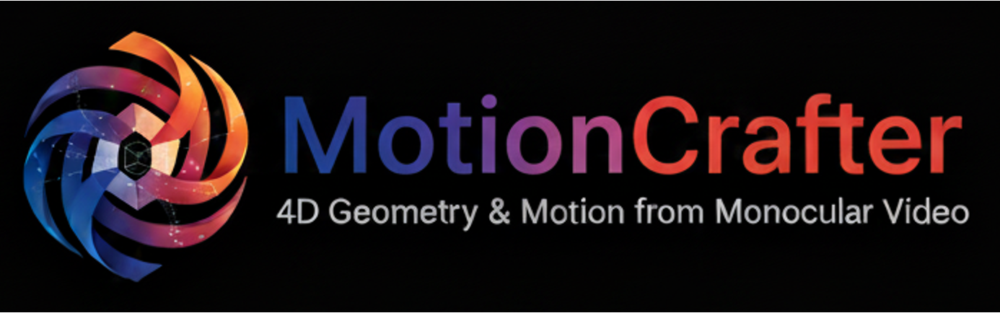

<div align="center">
</img>
</div>

<h3 align="center"><strong>MotionCrafter: Dense Geometry and Motion Reconstruction with a 4D VAE</strong></h3>

<p align="center">
  <a href="https://ruijiezhu94.github.io/ruijiezhu/">Ruijie Zhu</a><sup>1,2</sup>,</span>
  <a href="https://scholar.google.com/citations?user=cRpteW4AAAAJ&hl=en">Jiahao Lu</a><sup>3</sup>,</span>
  <a href="https://wbhu.github.io/">Wenbo Hu</a><sup>2</sup>,</span>
  <a href="https://scholar.google.com/citations?user=z-rqsR4AAAAJ&hl=en">Xiaoguang Han</a><sup>4</sup>,</span><br> 
  <a href="https://jianfei-cai.github.io/">Jianfei Cai</a><sup>5</sup>,</span>
  <a href="https://scholar.google.com/citations?user=4oXBp9UAAAAJ&hl=en">Ying Shan</a><sup>2</sup>,</span>
  <a href="https://physicalvision.github.io/people/~chuanxia">Chuanxia Zheng</a><sup>1</sup></span>
  <br>
  <sup>1</sup> NTU </span> 
  <sup>2</sup> ARC Lab, Tencent PCG </span> 
  <sup>3</sup> HKUST </span> 
  <sup>4</sup> CUHK(SZ) </span>
  <sup>5</sup> Monash University </span>
  <br>
  <b>CVPR 2026</b>
</p>


<div align="center">
  <a href='https://arxiv.org/abs/2602.08961'></a> &nbsp;&nbsp;&nbsp;&nbsp;&nbsp;
  <a href='https://ruijiezhu94.github.io/MotionCrafter_Page/'></a> &nbsp;&nbsp;&nbsp;&nbsp;&nbsp;
  <a href='https://huggingface.co/TencentARC/MotionCrafter'></a> &nbsp;&nbsp;&nbsp;&nbsp;&nbsp; 
  <a href='https://github.com/TencentARC/MotionCrafter/blob/main/LICENSE.txt'></a> &nbsp;&nbsp;&nbsp;&nbsp;&nbsp;
  <a href='https://youtu.be/oc0fRoZTyk8'></a> &nbsp;&nbsp;&nbsp;&nbsp;&nbsp;
  <a href='https://ruijiezhu94.github.io/MotionCrafter'></a>
  <br>
  <br>
</div>

<br>

<p align="center">

</p>

> We introduce MotionCrafter, the first video diffusion-based framework that jointly reconstructs 4D geometry and estimates dense object motion. Given a monocular video as input, MotionCrafter simultaneously predicts dense point map and scene flow for each frame within a shared world coordinate system, without requiring any post-optimization.


If you find MotionCrafter useful, **please help ⭐ this repo**, which is important to Open-Source projects. Thanks!

## 🚀 Quick Start

### 🛠️ Installation
1. Clone this repo:
```bash
git clone https://github.com/TencentARC/MotionCrafter
```
2. Install dependencies (please refer to [requirements.txt](requirements.txt)):
```bash
pip install -r requirements.txt
```

### 🔥 Inference

Run inference code with our default model:

```bash
python run.py \
  --video_path examples/video.mp4 \
  --save_folder examples_output
```

Run inference code with your own model:

```bash
python run.py \
  --video_path examples/video.mp4 \
  --save_folder examples_output \
  --cache_dir workspace/pretrained_models \
  --unet_path path/to/your/unet \
  --vae_path path/to/your/vae \
  --model_type determ \ # determ or diff
  --height 320 --width 640 \
  --adjust_resolution True \
  --num_frames 25
```

### Visualization

Visualize the predicted point maps & scene flows with `Viser`

```bash
python visualize/visualize.py \
  --video_path examples/video.mp4 \
  --data_path examples_output/video.npz
```

<!-- ## 🤖 Gradio Demo

- Online demo: [**MotionCrafter**](https://huggingface.co/spaces/TencentARC/MotionCrafter)
- Local demo:
  ```bash
  gradio app.py
  ``` -->

## 🌟 Training Your Own Model
### Dataset Preparation
To train MotionCrafter, you should download the training datasets following [DATASET.md](DATASET.md) and process the data following [datasets/preprocess/README.md](datasets/preprocess/README.md).

Or you can prepare your own data like this:

```tree
DATASET_NAME
├── SCENE_NAME_1
│   ├── xxxx.hdf5
│   ├── xxxx.mp4
├── SCENE_NAME_2
│   ├── xxxx.hdf5
│   ├── xxxx.mp4
└── mete_infos.txt
``` 

`xxxx.mp4` is the processed video, `xxxx.hdf5` is the processed annotations, including:
```
point_map: T x H x W x 3, camera-centric xyz coordinates.
camera_pose: T x 4 x 4, camera extrinsics.
valid_mask: T x H x W, valid mask for point map.
scene_flow (optional): T x H x W x 3, camera-centric dx dy dz.
deform_mask (optional): T x H x W, valid mask for scene flow.
```


### Model Training

First, we train Geometry VAE:
```shell
bash scripts/launch.sh configs/vae_train/geometry_vae_train.gin
```

Then, we combine the pretrained Geometry VAE to train Unified 4D VAE:
```shell
bash scripts/launch.sh configs/vae_train/unify_4d_vae_train.gin
```

Finally, we train the Diffusion Unet via the pretrained Unified 4D VAE:
```shell
# Deterministic Version
bash scripts/launch.sh configs/unet_train/unet_determ_unify_vae_train.gin
# Diffusion Version
bash scripts/launch.sh configs/unet_train/unet_diffusion_unify_vae_train.gin
```


### 📜 Citation

If you find our work useful, please cite:

```bibtex
@article{zhu2025motioncrafter,
  title={MotionCrafter: Dense Geometry and Motion Reconstruction with a 4D VAE},
  author={Zhu, Ruijie and Lu, Jiahao and Hu, Wenbo and Han, Xiaoguang and Cai, Jianfei and Shan, Ying and Zheng, Chuanxia},
  journal={arXiv preprint arXiv:2602.08961},
  year={2026}
}
```

### 🤝 Acknowledgements
Our code is based on [GeometryCrafter](https://github.com/TencentARC/GeometryCrafter). We thank Tianxing for providing the excellent codebase!


